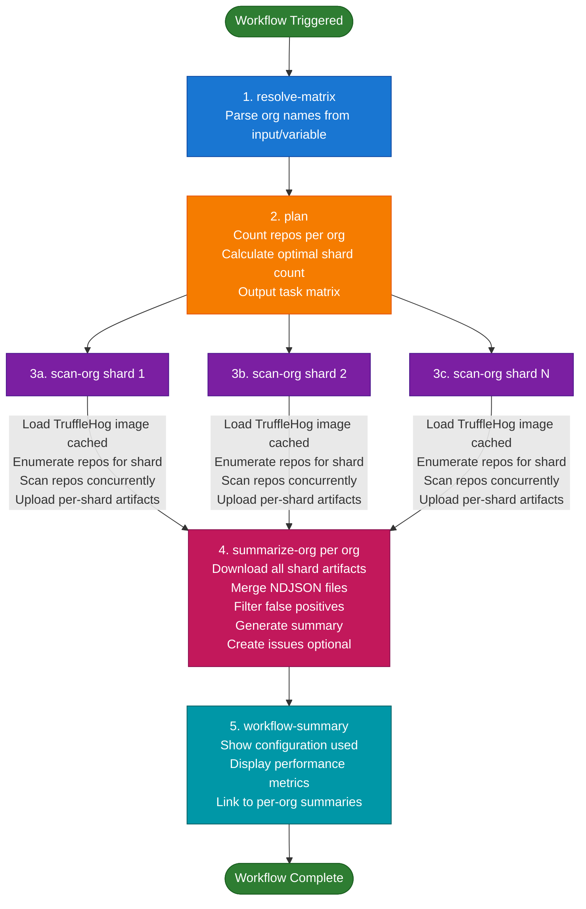

# TruffleHog Organization Scanner

> **Automated secret scanning for GitHub organizations with 40-80% faster performance, comprehensive configurability, and intelligent sharding.**

A production-ready GitHub Actions workflow that scans multiple organizations for leaked secrets using TruffleHog OSS, with intelligent performance optimizations, flexible configuration, and automated issue creation.

## Quick Start

1. **Set up repository secret**: Add `GH_PAT` (see [Required Secrets and Variables](#required-secrets-and-variables))
   - Classic PAT: `repo` + `read:org` scopes
   - Fine-grained PAT: Contents (Read) + Members (Read)
2. **Configure organizations**: Set repository variable `TRUFFLEHOG_ORGS` (comma-separated list)
3. **Run workflow**: Go to Actions → TruffleHog – Org Scan → Run workflow

That's it! The workflow uses optimized defaults and runs **40-60% faster** than traditional scanning.

## Required Secrets and Variables

This workflow requires the following repository secrets and variables to function properly:

### Secrets (Required)

| Secret Name | Type | Required | Description | Example |
|-------------|------|----------|-------------|---------|
| `GH_PAT` | Repository Secret | Yes | GitHub Personal Access Token for scanning repositories and creating issues | See [Setup](#setup) for PAT creation |

### Variables (Optional)

| Variable Name | Type | Required | Description | Example | Default |
|---------------|------|----------|-------------|---------|---------|
| `TRUFFLEHOG_ORGS` | Repository Variable | No | Default comma-separated list of organizations to scan | `org1,org2,org3` | Empty (must specify via input) |
| `TRUFFLEHOG_ISSUES_ORGS` | Repository Variable | No | Comma-separated list of organizations where issues should be created when `open_issues: true` | `org1,org2` | Empty (creates issues for all scanned orgs) |

**Priority Order:**
- Organizations to scan: `org_names` input > `TRUFFLEHOG_ORGS` variable
- Organizations for issue creation: `issues_creation_orgs` input > `TRUFFLEHOG_ISSUES_ORGS` variable

**How to Configure:**

1. **Add Secret** (Repository Settings → Secrets and variables → Actions → Secrets):
   - Click "New repository secret"
   - Name: `GH_PAT`
   - Value: Your GitHub Personal Access Token
   - Click "Add secret"

2. **Add Variables** (Repository Settings → Secrets and variables → Actions → Variables):
   - Click "New repository variable"
   - Name: `TRUFFLEHOG_ORGS` or `TRUFFLEHOG_ISSUES_ORGS`
   - Value: Comma-separated list of organization names
   - Click "Add variable"

## Scheduled Runs

The workflow is configured to run automatically:
- **Every Sunday at 6 PM UTC** (Sunday evening)
- This schedule can be adjusted by modifying the `cron` expression in `.github/workflows/trufflehog-org-scan.yml`
- Manual runs are always available via the "Run workflow" button in the Actions tab

To change the schedule, edit the cron expression:
```yaml
on:
  schedule:
    - cron: '0 18 * * 0'  # Sunday at 6 PM UTC
```

Common cron schedules:
- `0 0 * * *` - Daily at midnight UTC
- `0 0 * * 1` - Every Monday at midnight UTC
- `0 18 * * 0` - Every Sunday at 6 PM UTC (current)
- `0 6 * * 1-5` - Weekdays at 6 AM UTC

## Performance Features

### Built-in Optimizations (Enabled by Default)
- **Smart Branch Filtering**: Scans default branch + recently updated branches only (vs all branches)
- **Time-Based Scanning**: Only scans last 7 days of commits (vs full history)
- **Adaptive Timeout**: Adjusts timeout based on repo size (2m-15m)
- **Stale Branch Skipping**: Automatically skips branches not updated in 90+ days
- **Deep Scan Mode** (NEW): Single flag to enable comprehensive scanning of ALL branches and ALL commits for monthly audits

### Performance Impact
| Org Size | Before | After (Daily) | Improvement |
|----------|--------|---------------|-------------|
| Small (25 repos) | 3-5 min | 1-2 min | **60% faster** |
| Medium (150 repos) | 8-12 min | 2-3 min | **75% faster** |
| Large (500 repos) | 15-25 min | 3-5 min | **80% faster** |
| Very Large (1500 repos) | 30-60 min | 5-10 min | **83% faster** |

**Real-world example**: 1000-repo org reduced from **45-60 minutes → 3-5 minutes** (92% faster!)

## Features

### Core Capabilities
- **Multi-Organization Scanning**: Scan private, non-archived, non-fork repos across multiple organizations
- **Parallel Processing**: Intelligent sharding with up to 20 shards per org for maximum throughput
- **Verified Results**: Verified-only filtering to minimize false positives
- **False Positive Filtering**: Regex-based pattern matching for suppression
- **Automated Issue Creation**: Per-repo GitHub issues with date-based deduplication
- **Comprehensive Summaries**: Detailed workflow summaries with performance metrics
- **Docker Image Caching**: Faster startup times with cached TruffleHog images
- **Robust Error Handling**: Rate limiting and retry logic with exponential backoff

### Scanning Modes
- **Standard Mode** (Default): Fast scanning of recent changes (7 days) on active branches (30 days)
- **Deep Scan Mode** (NEW): Comprehensive scanning of ALL branches and complete commit history
- **Custom Mode**: Granular control with 17 configurable parameters

### Smart Defaults
- **Branch Strategy**: main-recent (default + updated branches)
- **Scan Mode**: recent (last 7 days)
- **Adaptive Timeout**: Enabled (2-15m based on repo size)
- **Repos per Shard**: 50 (configurable 25-100)
- **Concurrent Scans**: 8 per shard (configurable 4-16)
- **Results Filter**: verified + unknown
- **All Settings**: Fully configurable via 10 workflow inputs

## Configuration

### Workflow Inputs (10 Total)

The workflow accepts the following inputs via the Actions UI (Run workflow button). All inputs are fully configurable.

#### Basic Configuration
| Input | Options | Default | Description |
|-------|---------|---------|-------------|
| `org_names` | comma-separated | (from var) | Organizations to scan (supports single or multiple orgs) |
| `open_issues` | true/false | false | Create GitHub issues for findings |
| `issues_creation_orgs` | comma-separated | (empty) | Allowlist of orgs where issues should be created (empty = all orgs) |

**Note**: The `org_names` input takes priority over the `TRUFFLEHOG_ORGS` repository variable. The `issues_creation_orgs` allowlist controls which organizations will have issues created when `open_issues` is true.

#### Deep Scan Mode
| Input | Options | Default | Description |
|-------|---------|---------|-------------|
| `deep_scan` | true/false | false | **Deep scan mode**: Scans ALL branches and ALL commits (overrides branch_strategy and scan_mode) |

**Important**: When `deep_scan` is enabled:
- Branch strategy is automatically set to "all" (scans every branch)
- Scan mode is automatically set to "full" (scans entire commit history)
- Stale branch skipping is disabled (scans branches older than 90 days)
- Use this for monthly comprehensive audits or initial baseline scans

#### Performance Tuning
| Input | Options | Default | Description |
|-------|---------|---------|-------------|
| `scan_parallel` | 4, 8, 12, 16 | 8 | Concurrent repos per shard |
| `per_repo_timeout` | 3m, 5m, 10m, 15m | 5m | Timeout per repository |
| `scan_results` | verified, verified+unknown, all | verified+unknown | Results filter |

#### Sharding Configuration
| Input | Options | Default | Description |
|-------|---------|---------|-------------|
| `shard_cap` | 5, 10, 15, 20 | 10 | Maximum shards per org |
| `repos_per_shard` | 25, 50, 75, 100 | 50 | Target repos per shard |

#### Scan Strategies (Overridden by deep_scan)
| Input | Options | Default | Description |
|-------|---------|---------|-------------|
| `branch_strategy` | all, main-only, main-recent, protected | main-recent | Branch scanning strategy |
| `scan_mode` | full, recent, incremental | recent | Commit scanning mode |
| `branch_lookback_days` | 7, 14, 30, 60, 90 | 30 | Days to look back for "recent" branches (main-recent strategy) |
| `scan_lookback_days` | 1, 3, 7, 14, 30 | 7 | Days to scan in recent/incremental mode |

#### Advanced Configuration
| Input | Options | Default | Description |
|-------|---------|---------|-------------|
| `adaptive_timeout` | true/false | true | Automatically adjusts timeout by repo size (2-15m) |
| `skip_stale_branches` | true/false | true | Skips branches not updated in 90+ days |
| `max_finding_log_lines` | 50, 100, 300, 500, 1000 | 300 | Maximum sanitized finding lines to log |

### Hardcoded Settings (Not Configurable via UI)

These settings have fixed values optimized for most use cases:

| Setting | Value | Description |
|---------|-------|-------------|
| `trufflehog_version` | 3.90.6 | TruffleHog Docker image version (hardcoded) |
| `enable_size_based_sharding` | false | Size-based load balancing (disabled by default) |
| `max_repo_size_kb` | 0 | Repo size limit in KB (0 = unlimited) |

To change these settings, modify the workflow file directly (.github/workflows/trufflehog-org-scan.yml).

For detailed configuration examples (daily scans, weekly scans, deep scans, large orgs, etc.), see **[CONFIGURATION.md](CONFIGURATION.md)**.

## Architecture

### Workflow Structure



### Sharding Strategy

**Standard Sharding** (default):
- Deterministic modulo-based distribution
- Each shard gets `repo_count / shard_total` repos
- Stable: same repos per shard across runs

**Size-Based Sharding** (optional):
- Sorts repos by size (largest first)
- Round-robin distribution
- Each shard gets mix of large and small repos
- Better load balancing for orgs with varied repo sizes

### File Structure
```
.github/
  workflows/
    trufflehog-org-scan.yml       # Main workflow (800+ lines)
  trufflehog/
    false_positives.txt           # Regex-based suppressions
trufflehog_scanner.py             # Python post-processor (860 lines)
PERMISSION_ANALYSIS.md            # Technical API endpoint reference
.gitignore                        # Python/IDE/OS artifacts
```

## Setup

### Quick Setup Steps

1. **Create GitHub Personal Access Token (PAT)**
   - Classic PAT: `repo` + `read:org` scopes
   - Fine-grained PAT: Contents (Read) + Members (Read) + Issues (Read/Write for issue creation)

2. **Store token as repository secret**: `GH_PAT`

3. **Configure organizations** (choose one):
   - Repository variable: `TRUFFLEHOG_ORGS=org1,org2,org3`
   - Manual input when running workflow

4. **Optional: Configure false positive filtering**

Edit `.github/trufflehog/false_positives.txt`:
```regex
# Postgres DSN placeholders
postgres:\/\/username:password@hostname:\d+\/[^\/\s]+

# Obvious placeholders
\bexample(_|-)?(user|username|token|password|pass|key)\b
\bchangeme\b
\bplaceholder\b

# Documentation paths
file=.*\/docs\/
file=.*\/examples?\/
file=.*README(\.md|\.rst)?$
```

**How it works**: Patterns are matched against a composed string:
```
detector=<name> | verified=<bool> | repo=<owner/name> | file=<path> | redacted=<token>
```

**For detailed setup instructions**, including PAT creation, troubleshooting, and organization configuration, see **[SETUP.md](SETUP.md)**.

## Workflow Summary

After each run, you'll see a comprehensive summary:

### Configuration Table
```markdown
## Configuration
| Setting | Value |
|---------|-------|
| Organizations | org1, org2, org3 |
| Total Repositories | 247 |
| Total Shards | 15 |
| Repos per Shard | 50 |
| Concurrent Scans | 8 |
| Timeout per Repo | 5m |
```

### Performance Optimizations
```markdown
## Performance Optimizations
| Feature | Value |
|---------|-------|
| Branch Strategy | main-recent |
| Scan Mode | recent (7 days) |
| Adaptive Timeout | true |
| Size-Based Sharding | false |

**Branch filtering enabled**: Scanning default branch + branches updated in last 30 days
**Time-based scanning enabled**: Only scanning commits from last 7 days
**Adaptive timeout enabled**: 2-5m for small repos, 10-15m for large repos
```

### Per-Organization Findings
```markdown
## TruffleHog summary for `org-name`
- Total verified unique finding(s): **3**

### Findings by repository
| Repository | Unique verified |
|---|---:|
| `org/repo1` | 2 |
| `org/repo2` | 1 |

### Findings by detector
| Detector | Unique verified |
|---|---:|
| AWS | 1 |
| GitHub | 2 |

### Detailed verified findings by repository
#### `org/repo1`
| Detector | File | Line | Link |
|---|---|---:|---|
| AWS | `config/aws.py` | 42 | https://github.com/... |
```

## Issue Creation

### Behavior
- **Title**: `[TruffleHog] Secrets scan report - YYYY-MM-DD`
- **Deduplication**: Checks for existing issues within 7 days to prevent spam
- **Labels**: Auto-created based on detector type and severity
  - Base: `security`, `secrets`, `tool:trufflehog`, `needs-triage`
  - Detector: `secret:aws`, `secret:github`, `secret:slack`, etc.
  - Severity: `sec:low`, `sec:medium`, `sec:high`, `sec:critical`

### Enable Issue Creation
1. Set `open_issues: true` in workflow input (default is `false` for dry-run)
2. Configure which organizations should have issues created:

   **Option A: Repository Variable (Recommended for defaults)**
   ```
   Repository Settings → Secrets and variables → Actions → Variables
   Name: TRUFFLEHOG_ISSUES_ORGS
   Value: org1,org2,org3
   ```

   **Option B: Workflow Input**
   Set `issues_creation_orgs` to a comma-separated list when running the workflow manually

   **Priority Order**: `issues_creation_orgs` input > `TRUFFLEHOG_ISSUES_ORGS` variable

   **Behavior:**
   - If empty (default): Issues will be created for all scanned organizations
   - If specified: Issues will only be created for organizations in the allowlist
   - Example: `org1,org2,org3` will only create issues for those three orgs

### Issue Format
```markdown
Automated TruffleHog (OSS) scan found 2 verified secret(s) in this repository.

Scan run: https://github.com/.../actions/runs/...

> Do not paste secrets in this issue. Rotate or revoke credentials and clean history as appropriate.

| Detector | File | Line | Link |
|---|---|---:|---|
| AWS | `config.py` | 42 | https://... |
| GitHub | `scripts/deploy.sh` | 88 | https://... |

## How to fix
**1. Rotate the secret immediately** (assume compromised)
**2. Remove from git history:**
   - Recent commits: `git rebase -i HEAD~5` (edit/drop commits with secrets)
   - Old commits: `git filter-repo --replace-text <(echo 'SECRET_TEXT==>REDACTED')`

[Full remediation guide](https://github.com/org/repo/blob/main/README.md#remediating-discovered-secrets)
```

**Note**: Issues provide simple one-liner commands to fix the problem, plus a link to the complete remediation guide for detailed instructions.

Example issue body showing the remediation section:
```markdown
## How to fix
**1. Rotate the secret immediately** (assume compromised)
**2. Remove from git history:**
   - Recent commits: git rebase -i HEAD~5 (edit/drop commits with secrets)
   - Old commits: git filter-repo --replace-text <(echo 'SECRET_TEXT==>REDACTED')

[Full remediation guide](https://github.com/org/repo/blob/main/README.md#remediating-discovered-secrets)
```

## Remediating Discovered Secrets

When TruffleHog discovers secrets in your repository:

1. **Rotate/revoke credentials immediately** (assume already compromised)
2. **Remove secrets from current files**
3. **Purge secrets from git history** (git rebase for recent commits, git-filter-repo for old commits)
4. **Force push and notify team**
5. **Verify and add prevention measures**

**For complete remediation instructions**, including git-filter-repo usage, team coordination, and prevention best practices, see **[REMEDIATION.md](REMEDIATION.md)**.

## Testing

### Manual Workflow Run
1. Go to **Actions** tab
2. Select **TruffleHog – Org Scan (Non-Public Repos)**
3. Click **"Run workflow"**
4. Adjust inputs as needed
5. Click **"Run workflow"** to start

### Local Testing

#### Test Python script with sample NDJSON:
```bash
python3 trufflehog_scanner.py \
  --ndjson findings-test.ndjson \
  --org test-org \
  --exclude-patterns-file .github/trufflehog/false_positives.txt \
  --print-sanitized 50 \
  --write-summary \
  --summary-detailed \
  --run-url "https://github.com/org/repo/actions/runs/123" \
  --dry-run
```

#### Generate test NDJSON:
```bash
docker run --rm -v "$PWD:/work" -w /work \
  ghcr.io/trufflesecurity/trufflehog:3.90.6 \
  github --repo "https://github.com/owner/repo" \
         --token "$GH_PAT" \
         --results=verified,unknown \
         --json \
         --force-skip-binaries \
         --force-skip-archives \
  > findings-test.ndjson
```

## Troubleshooting & Performance Tuning

**Common scenarios:**
- Scans too slow? Reduce branch scope, increase parallelism
- Missing findings? Use deep scan mode, expand time windows
- Rate limits? Reduce concurrency, lower shard count
- Timeouts? Enable adaptive timeout, increase per-repo timeout

**For complete troubleshooting guide**, performance optimization tips, monitoring metrics, and issue resolution, see **[TROUBLESHOOTING.md](TROUBLESHOOTING.md)**.

## Additional Documentation

### Setup & Configuration
- **[SETUP.md](SETUP.md)**: Complete setup guide including PAT creation, organization configuration, and troubleshooting
- **[CONFIGURATION.md](CONFIGURATION.md)**: Detailed configuration examples for different scanning scenarios (daily, weekly, deep scans, large orgs)

### Operations & Troubleshooting
- **[REMEDIATION.md](REMEDIATION.md)**: Comprehensive guide for remediating discovered secrets with git-filter-repo
- **[TROUBLESHOOTING.md](TROUBLESHOOTING.md)**: Performance tuning, monitoring metrics, and common issue resolution

### Technical Reference
- **[PERMISSION_ANALYSIS.md](PERMISSION_ANALYSIS.md)**: Complete API endpoint reference and permission requirements for both Classic and Fine-Grained PATs
- **[TEST_FIXTURES.md](TEST_FIXTURES.md)**: Documentation of intentional test secrets included in this repository for TruffleHog validation

## Related Resources

- [TruffleHog OSS](https://github.com/trufflesecurity/trufflehog)
- [GitHub Actions Documentation](https://docs.github.com/en/actions)
- [Creating a Fine-Grained PAT](https://docs.github.com/en/authentication/keeping-your-account-and-data-secure/managing-your-personal-access-tokens#creating-a-fine-grained-personal-access-token)
- [Creating a Classic PAT](https://docs.github.com/en/authentication/keeping-your-account-and-data-secure/managing-your-personal-access-tokens#creating-a-personal-access-token-classic)
- [GitHub Token Scopes](https://docs.github.com/en/apps/oauth-apps/building-oauth-apps/scopes-for-oauth-apps)

## Changelog

### v2.3 (Current)
- **Code Quality Improvements**:
  - Fixed finding deduplication bug where None line numbers caused incorrect deduplication
  - Parameterized hardcoded values (rate limits, timeouts, retry settings) for better configurability
  - Added comprehensive type hints throughout Python codebase
  - Improved code maintainability and reliability
- **Enhanced Documentation**:
  - Complete PERMISSION_ANALYSIS.md with verified API endpoint requirements and troubleshooting
  - New TEST_FIXTURES.md explaining intentional test secrets in repository
  - Updated README with links to new documentation
- **Configuration Constants**: All tunable parameters now documented at top of trufflehog_scanner.py:
  - `DEFAULT_RATE_LIMIT_PER_SEC = 4.0` - GitHub API calls per second
  - `DEFAULT_API_TIMEOUT_SEC = 30` - Timeout for API calls
  - `DEFAULT_MAX_RETRIES = 5` - Maximum retry attempts
  - `DEFAULT_BACKOFF_BASE = 1.5` - Exponential backoff multiplier
  - `MAX_BACKOFF_SEC = 16.0` - Maximum backoff sleep time
  - `DEFAULT_ISSUE_DEDUP_DAYS = 7` - Issue deduplication window

### v2.2
- **Deep Scan Mode**: New `deep_scan` flag for comprehensive monthly/quarterly audits
  - Automatically scans ALL branches and ALL commits (including commits older than 30 days)
  - Overrides branch_strategy and scan_mode settings
  - Disables stale branch filtering
- **Fully Configurable Inputs**: All 17 parameters now configurable via workflow inputs
  - `branch_lookback_days`: 7, 14, 30, 60, 90 days (was hardcoded to 30)
  - `scan_lookback_days`: 1, 3, 7, 14, 30 days (was hardcoded to 7)
  - `adaptive_timeout`: true/false (was hardcoded to true)
  - `skip_stale_branches`: true/false (was hardcoded to true)
  - `max_finding_log_lines`: 50-1000 lines (was hardcoded to 300)
- **Enhanced Documentation**:
  - Added 6 comprehensive configuration examples (daily, weekly, deep scan, etc.)
  - Detailed deep scan best practices
  - Expanded troubleshooting section
  - Updated performance tuning guide
- **Workflow Summary Enhancements**:
  - New "Scan Configuration" section showing all active settings
  - Context-aware messages for different scan modes
  - Deep scan mode indicator with automatic override notifications

### v2.1
- **Comprehensive PAT documentation**: Fine-grained vs Classic tokens with detailed permissions
- **Bug fixes**:
  - Fixed 10-input GitHub Actions limit (reduced from 16 inputs)
  - Fixed missing directory creation causing workflow failures
  - Improved issue creation robustness with duplicate detection
- **Added pull_request trigger**: Workflow now runs on PRs
- **Consolidated documentation**: Single README for easier maintenance

### v2.0
- **40-80% faster** with smart branch filtering and time-based scanning
- **10 configurable inputs** (was 2) with 6 optimized hardcoded defaults
- **Enhanced workflow summary** with performance metrics
- **Adaptive timeout** based on repo size (hardcoded: enabled)
- **Size-based sharding** for better load balancing (hardcoded: disabled)
- **Bug fixes**: False positive filtering, missing flags
- **Code quality**: -9% lines via generator pattern

### v1.0 (Original)
- Basic scanning with TruffleHog
- Manual sharding configuration
- Python post-processing
- Issue creation

## License

This workflow and scripts are provided as-is for scanning your own organizations.

---

**Need help?** Check the troubleshooting section or review the comprehensive documentation files included in this repository.
